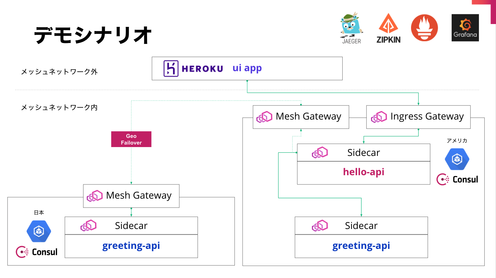

* replace values
1. `proxy-configs/proxy-defaults.hcl`: Jaeger's host IP
2. `greetings-api` -> `applications.properties`: Jaeger's host IP
3. `hello-api` -> `applications.properties`: Jaeger's host IP

* US
```
gcloud container clusters create lab-cluster \
 --num-nodes=5 \
 --zone us-central1-c

gcloud container clusters get-credentials lab-cluster \
 --zone us-central1-c \
 --project se-kabu

kc delete secret/consul-federation

helm install -f helm/us.yaml consul hashicorp/consul --wait

kc get secret consul-federation -o yaml > consul-federation-secret.yaml

kc apply -f greetings-us.yaml
kc apply -f hello.yaml
```

* Japan
```
gcloud container clusters create lab-cluster-2 \
 --num-nodes=3 \
 --zone asia-northeast1-a

gcloud container clusters get-credentials lab-cluster-2 \
 --zone asia-northeast1-a \
 --project se-kabu
 
kc delete secret/consul-federation
kc apply -f consul-federation-secret.yaml

helm install -f helm/japan.yaml consul hashicorp/consul --wait

kc apply -f greetings-jp.yaml
```

* Proxy Setup
```
consul config write proxy-configs/proxy-defaults.hcl
consul config write proxy-configs/hello-api-svc-defaults.hcl
consul config write proxy-configs/greetings-api-svc-defaults.hcl
consul config write proxy-configs/ingress-gateway.hcl
consul config write proxy-configs/greetings-resoliver.hcl
```

* Deploy UI
```
cd greetings-ui
rm -rf .git
heroku login
git init
git add .
git commit -m "first commit"
heroku create
heroku config:set ingress_url=<INGRESSGW_LB_IP>:8080
heroku config:set service_fqdn=hello-api.ingress.dc-1.consul:8080
git push heroku master
heroku open
```

* Grafana Password
```
kubectl get secret --namespace onecluster-servicemesh grafana -o jsonpath="{.data.admin-password}" | base64 --decode ; echo
```

* Prometheus & Grafana
```
helm install -f helm/prometheus-values.yaml prometheus prometheus-community/prometheus --wait
helm install -f helm/grafana-values.yaml grafana grafana/grafana --wait
```

* Jaeger
```
docker run -d --name jaeger \
  -e COLLECTOR_ZIPKIN_HOST_PORT=:9411 \
  -p 5775:5775/udp \
  -p 6831:6831/udp \
  -p 6832:6832/udp \
  -p 5778:5778 \
  -p 16686:16686 \
  -p 14268:14268 \
  -p 14250:14250 \
  -p 9411:9411 \
  jaegertracing/all-in-one:1.22
```

* resize GKE
```
gcloud container clusters resize lab-cluster \
    --node-pool default-pool \
    --num-nodes 3 \
    --zone us-central1-c

gcloud container clusters resize lab-cluster-2 \
    --node-pool default-pool \
    --num-nodes 3 \
    --zone asia-northeast1-a
```